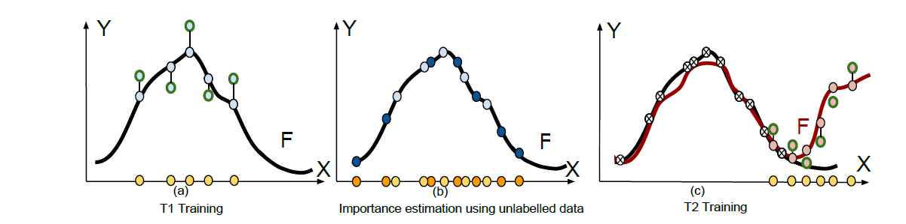

# MAS
Humans can learn in a continuous manner. Old rarely utilized knowledge can be overwritten by new incoming information while important, frequently used knowledge is prevented from being erased. In artificial learning systems,
lifelong learning so far has focused mainly on accumulating knowledge over tasks and overcoming catastrophic forgetting. In this paper, we argue that, given the limited model capacity and the unlimited new information to be learned, knowl-
edge has to be preserved or erased selectively. Inspired by neuroplasticity, we propose a novel approach for lifelong learning, coined Memory Aware Synapses(MAS). It computes the importance of the parameters of a neural network in an
unsupervised and online manner. Given a new sample which is fed to the network,MAS accumulates an importance measure for each parameter of the network,  based  on  how  sensitive  the  predicted  output  function  is  to  a  change  in
this parameter. When learning a new task, changes to important parameters can then be penalized, effectively preventing important knowledge related to previous tasks from being overwritten. Further, we show an interesting connection between
a local version of our method and Hebb’s rule, which is a model for the learning process  in  the  brain.  We  test  our  method  on  a  sequence  of  object  recognition tasks and on the challenging problem of learning an embedding for predicting
<subject, predicate, object> triplets. We show state-of-the-art performance and, for the first time, the ability to adapt the importance of the parameters based on unlabeled data towards what the network needs (not) to forget, which may vary
depending on test conditions.

This directory contains a pytorch implementation of Memory Aware Synapses: Learning what not to forget method. A demo file that shows a learning scenario in mnist split set of tasks is included.

## Authors

Rahaf Aljundi, Francesca Babiloni, Mohamed Elhoseiny, Marcus Rohrbach and Tinne Tuytelaars

For questions about the code, please contact me, Rahaf Aljundi (rahaf.aljundi@esat.kuleuven.be)
## Requirements
The code was built using pytorch version 0.3, python 3.5 and cuda 9.1
## Citation
Aljundi R., Babiloni F., Elhoseiny M., Rohrbach M., Tuytelaars T. (2018) Memory Aware Synapses: Learning What (not) to Forget. In:  Computer Vision – ECCV 2018. ECCV 2018. Lecture Notes in Computer Science, vol 11207. Springer, Cham

## License

This software package is freely available for research purposes.

## Our Work

# Introduction
Learning algorithms, in particular deep learning methods achieved a great performance on supervised learning tasks such as image classification, object detection, and speech recognition. 
The general formulation of classic supervised learning is to minimize the following risk minimization problem based on the a finite sample from the unknown, but fixed distribution P*.

However, the assumption that the training data follow a fixed distribution during the time has several limitations and many applications and problems cannot be fomulated 
in this framework. For instance, if the learning problem consists of several tasks with different distributions (different image datasets), updating the parameters of the model
upon the arrival of data from the new task leads to poor performance on the previous learned tasks. 
The procedure of continuous learning of different tasks with just one model such as a deep neural network is known as lifelong learning. Lifelong learning enables us to learn continually
from tones of images, videos, and other media contents generated daily on internet, without forgetting the learned model based on the previous data. The following figure illustrates 
the lifelong learning high-level idea. 

A question might arise is that whether the classic formulation of supervised learning can lead to a reliable performance on different tasks and datasets. The experimental results
show that by updating the parameters of a deep neural network upon the arrival of new task, the performance of the network on previous tasks decreases profoundly. This phenomenon is known as catastrophic forgetting. 
Lifelong learning has emerged to address the issue of catastrophic forgetting and enabling learning models to have an acceptable performance on both current and previous tasks.  
We can summarize the assumptions of lifelong learning as follows: 

1. In contrast to the classical supervised learning, Lifelong learning is not task specific, and its goal is to learn different tasks during the time. 
2. When a new task is arrived, the model does not have access to sample data from the previous tasks. 
3. It is similar to the online learning in a sense that the whole data from different tasks are not available and they arrive during the time; However, unlike the online learning we cannot assume the data points are sampled from a single data distribution.
Each task can have its own distribution. In this way, the lifelong learning is a harder problem.

# Existing Approaches

In this section we introduce several well-known lifelong learning methods propsed in recent years. Generally speaking, these methods can be divided into two groups:
## Data-based approaches
**Data-based approaches** use data from the new task to approximate the performance of the previous tasks. This works best if the data distribution mismatch between tasks is limited. 
Data based approaches are mainly designed for a classification scenario and overall, the need of these approaches to have a preprocessing step before each new task, 
to record the targets for the previous tasks is an additional limitation. 

### Encoder-based Lifelong Learning (EBLL)
In this method, for each new task an autoencoder which projects the dataset to a lower dimensional space is learned. Also a fully connected layer is added to the network
per task. Combining these two ideas, the network can learn different tasks whithout completely forgetting the previous tasks.

### Learning Without Forgetting (LwF)
This approach defines three sets of parameters:  are the shared parameters among all different tasks. For each given task,  represents the set of parameters
defined specifically for this task, and  denotes all the parameters from the previous tasks.  parameters are added to the last layer of the network 
(Typically a fully-connected layer) upon the arrival of new task data. To train this network for the new task, first they freeze  and  and train the network 
until the convergence of . Then they use these parameters as an initilization for joint training of all parameters of the network. This method is based on the 
optimization of the network for the data of the new task. Thus it can be considered as a data-based approach. 

## Model Based Approaches
Model base approaches focus on the parameters of the network instead of depending on the task data. They estimate an importance weight for each model parameter and add a regularizer when training a new task that penalizes any changes to important parameters.
The difference between methods in this approach lies in the way the importance weights are computed. 

###  Elastic Weight Consolidation
This method is based on the intution that in an over-parametrized regime (The number of nodes in the network is from the order of data points) there exists a  solution for task B which is very close to 
 a solution to task A. Based on this idea, they choose a minimizer of the network to task B which is within a low-radius ball around .

###  Synaptic Intelligence (SI)
In the Synaptic Intelligence work importance weights are computed during training in an online manner. To this end, they record how much the loss would change due to a change in a specific parameter and accumulate this information over the training trajectory. However, also this method has some drawbacks:
1. Relying on the weight changes in a batch gradient descent might overestimate the importance of the weights, as noted by the authors.
2. When starting from a pretrained network, as in most practical computer vision applications, some weights might be used without big changes. As a result, their importance will be underestimated.
3. The computation of the importance is done during training and fixed later.

# Memory Aware Synapses (MAS)
As a high level description, memory-aware synapses is a model-based approach which computes the importance of all network parameters by taking the gradient of output logits with 
respect to each weight parameter. Then it penalizes the objective function based on how much it changes the weights. If a weight parameter has more importance, the objective 
function is penalized more. By adding the mentioned regularizer, MAS outperforms the other model-based approaches as we experiment it on different lifelong learning problems.

The below figure shows how MAS is different from other penalty-based approaches. Other penalty-based approaches in the literature estimate the parameters importance based on the loss, 
comparing the network output (light blue) with the ground truth labels (green) using training data (in yellow) (a). In contrast to the previous model-based approaches, MAS estimates
the parameters importance, after convergence, based on the sensitivity of the learned function to their changes (b). This allows using additional unlabeled data points (in orange).
When learning a new task, changes to important parameters are penalized, the function is preserved over the domain densely sampled in (b), while adjusting not important parameters 
to ensure good performance on the new task (c).

Memory-aware Synapses enjoys several properties such as constant memory size, problem agnostic,  supporting  unlabeled  data,  adabptability, and also it can be established on 
top  of a pre-trained network on the previous tasks. Problem  agnostic property means this method can be generalized to any dataset and it is not limited to specific tasks or 
datasets. By adaptability we mean the capability of a method to adapt the learned model continually to a new task from the same or different environment. Thus it means the 
samples from different tasks should not necessarily follow a unique distribution and can have different ground truth distributions. The Memory-aware Synapses(MAS) satisfies 
all the properties mentioned above; However, it might not work equally well on all tasks. If the tasks which should be learned come in a different order, the trained model can 
be different, showing it puts more weights to the parameters of the most recent tasks. To cope with this issue, we introduce new parameters to MAS model to equalize the importance
of the tasks regardless of their training order. The experimental results show the same performance when we change the order of tasks and demonstrate a better average forgetting
comparing to MAS. We call the independence of the model from the order of tasks the consistency property. The following table depicts the properties satisfied by different models.
As we can observe, by introducing the new parameters to MAS model, we can outperform it and reduce the catastrophic forgetting.

**Method** | **Type** | **Constant Memory** | **Problem Agnostic** | **On Pre-trained** | **Unlabeled Data** | **Adaptive** | **Consistency**
--- | --- | --- | --- | --- | --- | --- | ---
LwF | Data | :heavy_check_mark: | :x: | :heavy_check_mark: | :x: | :x: | :x:
EBLL | Data | :x: | :x: | :x: | :x: | :x: | :x:
EWC | Model | :heavy_check_mark: | :heavy_check_mark: | :heavy_check_mark: | :x: | :x: | :x:
IMM | Model | :heavy_check_mark: | :heavy_check_mark: | :x: | :x: | :x: | :x:
SI | Model | :heavy_check_mark: | :heavy_check_mark: | :x: | :x: | :x: | :x:
MAS | Model | :heavy_check_mark: | :heavy_check_mark: | :heavy_check_mark: | :heavy_check_mark: | :heavy_check_mark: | :heavy_check_mark:
Alpha | Model | :heavy_check_mark: | :heavy_check_mark: | :heavy_check_mark: | :heavy_check_mark: | :heavy_check_mark: | :heavy_check_mark:

## A Simple Exmple to Show why MAS can consider some tasks more important.

# Problem Formulation
We use the model introduced in the paper, to start with and improve it as follows. For a given data point xk, the output of the network is  F(xk;&theta;). We approximate the gradient as F(xk;&theta;+&delta;) - F(xk;&theta;) &cong; &sum;i,j gij(xk)&delta;ij
where gij(xk) = dF(xk;&theta;)/d&theta;ij and &delta; = {&delta;ij} is a small perturbation, in the parameters &theta; = {&theta;ij}. So we consider a few last epochs of the learning to be able to have better estimation of the parameters importance. Our goal is to preserve the prediction of the network (the learned function) at each observed data point and prevent changes to parameters that are important for this prediction. We then accumulate the gradients over the given data points to obtain importance weight &Omega;tij in task t for parameter &theta;ij, &Omega;tij= 1/M &sum;k ||gij(xk)||,
in which M; is the size of training set. When a new task t;
is fetching into the network, we have in addition to the new task prediction error loss Lt(&theta;), a regularizer that penalizes changes to parameters that are deemed important for previous tasks: 

With &lambda; a hyperparameter for the regularizer and &theta;tij* is the ij parameter learned in task t. We add &alpha;t to make sure that we impose a consistency among tasks and so increase the accuracy, i.e. &sum;ij &alpha;t&Omega;tij = &sum;ij &alphat'&Omega;t'ij   &forall; t, t'. 
Note that this equation has infinitely many solutions; so, we should add an arbitrary constraint like &sum;t &alpha;t= &lambda;. Later on, we demonstrate that how this arbitrary constraint can be utilized as a hyperparameter to improve the results. 

# Implementation Details

# Results
