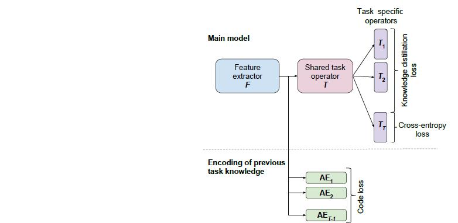

# Introduction
Learning algorithms especially deep learning methods achieved a reliable performance on supervised learning tasks such as image classification, object detection, and speech recognition.
The general objective of classic supervised learning is to minimize the following risk function based on a finite sample from the unknown, but fixed distribution P*.

However, the assumption that the training data follow a fixed distribution during the time has several limitations and many problems cannot be formulated in this framework. For instance, if the learning problem consists of several tasks with different distributions (different image datasets), updating the parameters of the model
upon the arrival of data from the new task leads to poor performance on the previously learned tasks. 
The procedure of continuous learning of different tasks with just one model such as a deep neural network is known as lifelong learning. Lifelong learning enables us to learn 
continually from tones of images, videos, and other media contents generated daily on the internet, without forgetting the learned model based on the previous data. 
The following figure illustrates the lifelong learning high-level idea. 

A question might arise is whether the classic formulation of supervised learning can lead to reliable performance on different tasks and datasets. The experimental results show that by updating the parameters of a deep neural network upon the arrival of a new task, the performance of the network on previous tasks decreases profoundly. This phenomenon is known as catastrophic forgetting. 
Lifelong learning has emerged to address the issue of catastrophic forgetting and enable learning models to have an acceptable performance on both current and previous tasks.  
We can summarize the assumptions of lifelong learning as follows: 

1. In contrast to the conventional supervised learning, Lifelong learning is not task-specific, and its goal is to learn different tasks during the time. 
2. When a new task arrives, the model does not have access to sample data from the previous tasks. 
3. It is similar to the online learning in a sense that the entire data from different tasks are not available and they arrive during the time; However, despite the online learning, we cannot assume the data points are sampled from a single data distribution. Each task can have a unique distribution different from other tasks. In this manner, lifelong learning is a more general problem, and thus harder to solve.

# Existing Approaches

In this section, we introduce several well-known lifelong learning methods proposed in recent years. Generally speaking, these methods can be divided into two groups:

## Data-based approaches
**Data-based approaches** use data from the new task to approximate the performance of the previous tasks. This works best if the data distribution mismatch between tasks is limited. 
Data based approaches are mainly designed for a classification scenario and overall, the need of these approaches to have a preprocessing step before each new task, to record the targets for the previous tasks is an additional limitation. 

### Encoder-based Lifelong Learning (EBLL) [2]
In this method, for each new task, an autoencoder which projects the dataset to a lower dimensional space is learned. Also, a fully connected layer is added to the network
per task. Combining these two ideas, the network can learn different tasks without completely forgetting the previous tasks.

### Learning Without Forgetting (LwF) [3]
This approach defines three sets of parameters:  are the shared parameters among all different tasks. For each given task,  represents the set of parameters
defined specifically for this task, and  denotes all the parameters from the previous tasks.  parameters are added to the last layer of the network 
(Typically a fully-connected layer) upon the arrival of new task data. To train this network for the new task, first they freeze  and  and train the network 
until the convergence of . Then they use these parameters as an initilization for joint training of all parameters of the network. This method is based on the 
optimization of the network for the data of the new task. Thus it can be considered as a data-based approach. 

## Model Based Approaches
Model-based approaches focus on the parameters of the network instead of depending on the task data. They estimate an importance weight for each model parameter and add a regularizer when training a new task that penalizes changes to important parameters.
The difference between methods in this approach lies in the manner the importance weights are computed. 

###  Elastic Weight Consolidation [4]
This method is based on the intution that in an over-parametrized regime (The number of nodes in the network is from the order of data points) there exists a  solution for task B which is very close to 
 a solution to task A. Based on this idea, they choose a minimizer of the network to task B which is within a low-radius ball around .

###  Synaptic Intelligence (SI) [5]
In the Synaptic Intelligence work importance weights are computed during training in an online manner. To this end, they record how much the loss would change due to a change in a specific parameter and accumulate this information over the training trajectory. However, also this method has some drawbacks:
1. Relying on the weight changes in a batch gradient descent might overestimate the importance of the weights, as noted by the authors.
2. When starting from a pre-trained network, as in most practical computer vision applications, some weights might be used without big changes. As a result, their importance will be underestimated.
3. The computation of the importance is done during training and fixed later.

# Memory Aware Synapses (MAS) [1]
As a high-level description, the memory-aware synapses is a model-based approach which computes the importance of all network parameters by taking the gradient of output logits with respect to each weight parameter. 
Then it penalizes the objective function based on how much it changes the weights. If a weight parameter has more importance, the objective function is penalized more. By adding the mentioned regularizer, 
MAS outperforms the other model-based approaches discussed above.

The below figure shows how MAS is different from other penalty-based approaches. Other penalty-based approaches in the literature estimate the importance of the parameters based on the taking gradient with respect to
loss, comparing the network output (light blue) with the ground truth labels (green) using training data (in yellow) (a). In contrast to the previous model-based approaches, MAS estimates
the importance of the parameters, after convergence, based on the sensitivity of the learned function to their changes (b). This allows using additional unlabeled data points (in orange).
When learning a new task, changes to important parameters are penalized, the function is preserved over the domain densely sampled in (b) while adjusting not important parameters 
to ensure good performance on the new task (c).

MAS enjoys several properties such as constant memory size, problem agnostic, supporting unlabeled data, adaptability, and also it can be established on top of a pre-trained network on the previous tasks. 
Problem agnostic property means this method can be generalized to any dataset and it is not limited to specific tasks or datasets. By adaptability, we mean the capability of a method 
to adapt the learned model continually to a new task from the same or different environment. Thus it means the samples from different tasks should not necessarily follow a unique 
distribution and can have different ground truth distributions. The Memory-aware Synapses(MAS) satisfies all the properties mentioned above; However, it might not work equally 
well on all tasks. 

## MAS can be biased towards one or more tasks! 
As we stated above the MAS approach, computes the importance(gradient of the output function) of parameters in the network with respect to each task. Then it aggregates the absolute values of these gradients and regularizing the objective function. Due to the difference in the distributions of tasks, the scale of the gradients can be varied among the tasks. Thus, it can lead to overfitting one or more tasks, and neglecting the rest. Moreover, these differences in scales can affect the importance estimation of each parameter in total comparing to the other weights.
To clarify the problem suppose we have a simple neural network with two weight parameters v and w, and two tasks T1 and T2. Let the
following table demonstrate the importance of v and w with respect to each task.

As we can observe, the importance of **v** is 5 times more than **w** with respect to task 1. But since the scales of weights importance are different among two tasks, at the end of the day, both **v** and **w** nearly have the same importance in the regularization term. This can lead to poor performance in task 1. To cope with this issue,
we introduce new scaling parameters per task to equalize the importance of different tasks and remove the bias towards one or more tasks. In contrast to MAS, our proposed approach considers
the same importance for all tasks which makes the final performance independent of tasks order. We refer to this feature as **consistency**. The following table depicts the properties satisfied by different models.

**Method** | **Type** | **Constant Memory** | **Problem Agnostic** | **On Pre-trained** | **Unlabeled Data** | **Adaptive** | **Consistency**
--- | --- | --- | --- | --- | --- | --- | ---
LwF | Data | :heavy_check_mark: | :x: | :heavy_check_mark: | :x: | :x: | :x:
EBLL | Data | :x: | :x: | :x: | :x: | :x: | :x:
EWC | Model | :heavy_check_mark: | :heavy_check_mark: | :heavy_check_mark: | :x: | :x: | :x:
IMM | Model | :heavy_check_mark: | :heavy_check_mark: | :x: | :x: | :x: | :x:
SI | Model | :heavy_check_mark: | :heavy_check_mark: | :x: | :x: | :x: | :x:
MAS | Model | :heavy_check_mark: | :heavy_check_mark: | :heavy_check_mark: | :heavy_check_mark: | :heavy_check_mark: | :x:
Alpha | Model | :heavy_check_mark: | :heavy_check_mark: | :heavy_check_mark: | :heavy_check_mark: | :heavy_check_mark: | :heavy_check_mark:

# Problem Formulation
We use the model introduced in the paper, to start with and improve it as follows. For a given data point xk, the output of the network is  F(xk;&theta;). We approximate the gradient as F(xk;&theta;+&delta;) - F(xk;&theta;) &cong; &sum;i,j gij(xk)&delta;ij
where gij(xk) = dF(xk;&theta;)/d&theta;ij and &delta; = {&delta;ij} is a small perturbation, in the parameters &theta; = {&theta;ij}. So we consider a few last epochs of the learning to be able to have better estimation of the parameters importance. Our goal is to preserve the prediction of the network (the learned function) at each observed data point and prevent changes to parameters that are important for this prediction. We then accumulate the gradients over the given data points to obtain importance weight &Omega;tij in task t for parameter &theta;ij, &Omega;tij= 1/M &sum;k ||gij(xk)||,
in which M; is the size of training set. When a new task t;
is fetching into the network, we have in addition to the new task prediction error loss Lt(&theta;), a regularizer that penalizes changes to parameters that are deemed important for previous tasks:

With &lambda; a hyperparameter for the regularizer and &theta;tij* is the ij parameter learned in task t. We add &alpha;t to make sure that we impose a consistency among tasks and so increase the accuracy, i.e. &sum;ij &alpha;t&Omega;tij = &sum;ij &alpha;t'&Omega;t'ij   &forall; t, t'. 
Note that this equation has infinitely many solutions; so, we should add an arbitrary constraint like &sum;t &alpha;t= &lambda;. Later on, we demonstrate that how this arbitrary constraint can be utilized as a hyperparameter to improve the results.

# Implementation Details
Since Pytorch is more flexible and gives more options for manipulating the gradients in back-propagation and changing the loss function comparing to the Tensorflow library, 
we implement all codes in Pytorch. We examined our method on the MNIST and CIFAR10 datasets. MNIST dataset contains 10 classes each of which corresponds to a digit. We break 
it into 5 tasks, each include two digits, as follow: task 1: (1,2), task 2: (3,4), task 3: (5,6), task 4: (7,8), task 5: (9,0). For the CIFAR10 datasets we divide the dataset
into five tasks: [Task 1: Bird, Automobile], [Task 2: Cat, Deer], [Task 3: Dog, Frog], [Task 4: Horse, Ship], [Task 5: Truck, Airplane]. The implementation is divided into 
three steps: (i) First, we learn the weights of our convolutional neural network by only considering the task 1. Thus, our first task to learn is the learning of the first two 
classes (ii) Then, we would learn the tasks 2 to 5, consecutively, by avoiding catastrophic forgetting according to the importance factor described earlier. (iii) Finally, we 
compute the forgetting coefficient for each task which is the difference between the accuracy of a network that is trained only for that specific task and the accuracy of the 
trained network for all tasks together. The average forgetting will be the average of forgetting values for all tasks. 

# Results
In this section, we provide the results of running the MAS and our variation of this method on the MNIST, and CIFAR10 data-sets. We compare our approach with the
baseline introduced by [1] where there is no optimization over alpha parameters.

As we can observe, our approach improves the forgetting value more than twice on average for the MNIST dataset. By forgetting the value of a task, we mean the difference 
between the accuracy of the model, trained jointly on all tasks and the model trained only on that specific task.

Since all the MNIST classes have very close distributions (white digits on a black background), the alpha coefficients are very close to each other. For instance, when the sum
of alphas equals to 5, the maximum alpha is 1.03, while the minimum one is 0.97. To observe the impact of our reformulation of the problem we implement our method on the CIFAR10
dataset. Since the class distributions are more diverse the vulnerability to the forgetting is higher. 

## Results on the MNIST dataset
Figure below shows the forgetting of each task for three different scenarios. Baseline means the original MAS formulation [1] in which the &alphat; is not optimized and it is equal for all tasks. Other methods are based on optimizing the &alphat value for all tasks by solving the earlier explained equations. Here, we play with hyperparameter &lambda; in &sum;t &alpha;t= &lambda; and change it to &lambda == N, 2N,... to investigate its impact. Please note that N indicates the number of tasks. By comparing the forgetting value of each task for difference scenarios, it is evident that there is more fluctuation on Baseline compare with our approach. This declares the consistency of our technique on forgetting per task.

To have a sense of overall performance of our approach compare with the baseline, we calculate the average and maximum forgetting for all five tasks. Figure below shows the result for average and maximum forgetting. 

(a) shows the forgetting value for each task for three different methods: Baseline (MAS default approach), Our method when the sum of alpha coefficients is N (number of tasks),
and when the sum of alpha coefficients is 2N. (b) compares the average forgetting of 5 tasks. As we can observe, our method has less forgetting value comparing to the default MAS.
(c) compares the validation accuracy per epochs for three different settings (Baseline, the sum of alphas equals to N, the sum of alphas equals to 2N).

Moreover, in the next plot (a), we can see the maximum forgetting value among all tasks for four different settings (MAS, sum alphas = N, sum alphas = 1.5N, sum alphas = 2N). This plot shows by adding the alpha coefficients, the
worst-case performance of the neural network on different tasks is decreased compared to MAS. (b) shows the independence of our method comparing to MAS from the order of tasks. 
In this experiment, we change the learning order of task [1, 2] from first to fifth. MAS works better if this task is the last one. But if the task is the first one in the
queue of tasks, MAS performance is different and it is less than when this task is the last one. However, in our method, the variation in the accuracy by changing the order of task in the task queue is less than MAS, due to the fact that we put equal weights on all tasks.

## Results on the CIFAR10 dataset
The next figure demonstrates the performance of our method comparing to the original MAS approach. (a) shows the validation accuracy of three different settings for 5 epochs.
(b) shows the forgetting value per task (each task consists of learning two labels of CIFAR10). (c) illustrates that the average forgetting value of our variation, is much less 
than the original MAS approach, and finally part (d) shows the worst-case performance of our method when the sum of alpha coefficients is 2N or 3N, is much better than the MAS.

  

# References
[1]  Aljundi, Rahaf, et al. "Memory aware synapses: Learning what (not) to forget." Proceedings of the European Conference on Computer Vision (ECCV). 2018.

[2] Rannen, Amal, et al. "Encoder based lifelong learning." Proceedings of the IEEE International Conference on Computer Vision. 2017.

[3] Li, Zhizhong, and Derek Hoiem. "Learning without forgetting." IEEE transactions on pattern analysis and machine intelligence 40.12 (2018): 2935-2947.

[4] Kirkpatrick, James, et al. "Overcoming catastrophic forgetting in neural networks." Proceedings of the national academy of sciences 114.13 (2017): 3521-3526.

[5] Zenke, Friedemann, Ben Poole, and Surya Ganguli. "Continual learning through synaptic intelligence." Proceedings of the 34th International Conference on Machine Learning-Volume 70. JMLR. org, 2017.
